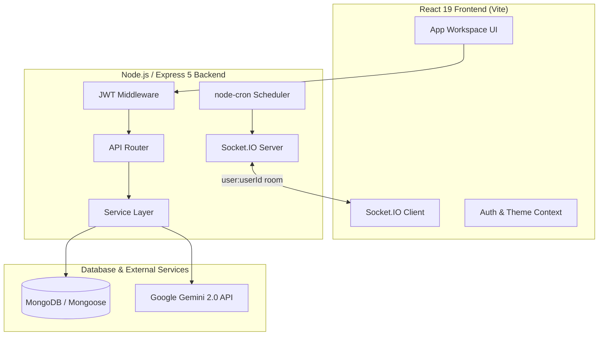

# PulseOS

> A real-time, AI-assisted productivity workspace designed to unify task planning, focus tracking, and workload analytics.


---

## 📌 Why PulseOS?

Most todo applications suffer from context fragmentation—tasks live in one list, timers in another app, and productivity analytics in spreadsheets. PulseOS integrates task management, Pomodoro focus tracking, background reminder scheduling, and AI-assisted workflow optimization into a single, user-isolated system.

---

## ⚡ Core Experience

### Tasks & Workspace
Full-lifecycle task CRUD with priority scoring, estimated duration, due dates, and customizable reminder triggers. All task states are bound to authenticated user accounts.

### Focus Engine
Configurable Pomodoro and Custom focus timers integrated with task binding. Completed focus intervals are automatically saved to `FocusSession` history and reflected in real-time metrics.

### Real-Time Reminders
Socket.IO room messaging (`user:<userId>`) coupled with a background cron scheduler (`node-cron`) to deliver isolated, real-time client alerts and trigger native browser notifications.

### Productivity Analytics
Analytical dashboard displaying streak counters, 7/14/30-day focus time trends, and planned vs. actual time performance metrics.

### AI Assistant
Backend-integrated Google Gemini 2.0 (`@google/genai`) service supporting subtask breakdown, time estimation, availability scheduling, and structured daily plan synthesis.

---

## 🏗 System Architecture



---

## 🛠 Tech Stack

- **Frontend**: React 19, Vite, Vanilla CSS Design System, Axios, React Router v7, Lucide Icons
- **Backend**: Node.js, Express 5, JWT (`jsonwebtoken`), `bcryptjs`
- **Database**: MongoDB, Mongoose 9
- **Realtime & Jobs**: Socket.IO 4, node-cron 4
- **AI Integration**: Google Gemini SDK (`@google/genai`)

---

## ⚙️ Setup & Environment Configuration

### Prerequisites
- Node.js v18.0.0+
- Local MongoDB or MongoDB Atlas instance

### Backend Setup

```bash
cd backend
npm install
cp .env.example .env
npm run dev
```

Configure `backend/.env`:

| Environment Variable | Purpose | Default / Example |
| :--- | :--- | :--- |
| `PORT` | Listening port | `3000` |
| `MONGO_URL` | MongoDB connection URI | `mongodb://localhost:27017/pulseos` |
| `CORS_ORIGIN` | Allowed CORS origin | `http://localhost:5173` |
| `JWT_SECRET` | Secret for signing JWTs | `your_jwt_secret_key_here` |
| `JWT_EXPIRES_IN` | Token expiration duration | `7d` |
| `GEMINI_API_KEY` | Backend-only Gemini key | `your_gemini_api_key_here` |
| `AI_MODEL` | Gemini model target | `gemini-2.0-flash` |

*Backend server runs at `http://localhost:3000`.*

### Frontend Setup

```bash
cd frontend
npm install
npm run dev
```

*Frontend client runs at `http://localhost:5173`.*

---

## 🌐 API Overview

All protected routes require `Authorization: Bearer <token>`.

| Module | Method | Endpoint | Description |
| :--- | :--- | :--- | :--- |
| **Auth** | `POST` | `/api/auth/register` | User account registration |
| | `POST` | `/api/auth/login` | Account login & JWT issuance |
| | `GET` | `/api/auth/me` | Current user profile |
| **Todos** | `GET` | `/api/todos` | List user tasks |
| | `POST` | `/api/todos` | Create task |
| | `PATCH` | `/api/todos/:id` | Update task status or fields |
| | `DELETE` | `/api/todos/:id` | Delete task |
| **Focus** | `POST` | `/api/focus/sessions` | Record focus session |
| | `GET` | `/api/focus/sessions` | Fetch session history |
| | `GET` | `/api/focus/summary` | Fetch focus metrics |
| **Analytics** | `GET` | `/api/analytics/overview` | Overview & streak metrics |
| | `GET` | `/api/analytics/focus-trend` | Focus trend (7, 14, 30 days) |
| | `GET` | `/api/analytics/task-performance` | Estimated vs actual focus ratio |
| **AI** | `POST` | `/api/ai/breakdown` | Generate subtasks |
| | `POST` | `/api/ai/estimate` | Estimate duration |
| | `POST` | `/api/ai/schedule` | Propose schedule blocks |
| | `POST` | `/api/ai/daily-plan` | Generate daily plan synthesis |

---

## 🧪 Verification & Test Quality

- **Backend Integration Tests**: `64 / 64 PASSED` (Auth, Data Ownership Isolation, Analytics, Sockets, AI Breakdown/Schedule/Plan)
- **Frontend Code Quality**: `0 ESLint errors, 0 warnings`
- **Production Build**: `Vite build completed successfully` (`15.09s`)

---

## 🚀 Future Roadmap

- Web Push service worker integration for background device notifications.
- Bi-directional Google Calendar and iCal synchronization.
- Team workspaces and shared task delegation.
- Voice-assisted task capture.

---

## 👨‍💻 Author

**Neeraj Mishra**
Full Stack Developer
GitHub: [https://github.com/Neeraj-code-beep](https://github.com/Neeraj-code-beep)
